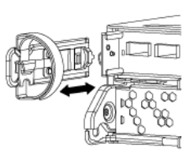

= Sustituya los módulos del sistema node1
:hardbreaks:
:allow-uri-read: 
:nofooter: 
:icons: font
:linkattrs: 
:imagesdir: ./media/

[role="lead"]
Sustituya los módulos del sistema node1 para su configuración de actualización:

* <<replace_modules,Sustituya el módulo de controlador AFF A220, AFF A200, AFF C190, FAS2620 o FAS2720>>
+

NOTE: También puede usar este procedimiento para reemplazar un AFF A220 configurado como ASA.

* <<Sustituya la controladora AFF A700 o FAS9000 y los módulos NVRAM>>
+

NOTE: También puede usar este procedimiento para reemplazar un AFF A700 configurado como ASA.

== Sustituya el módulo de controlador AFF A220, AFF A200, AFF C190, FAS2620 o FAS2720

En este momento, el nodo 1 está inactivo y todos los datos están servidos por el nodo 2. Como los nodos 1 y 2 están en el mismo chasis y están encendidos con el mismo conjunto de fuentes de alimentación, no apague el chasis. Debe tener cuidado de quitar solo el módulo del controlador node1. Normalmente, el nodo 1 es la controladora A, situada en el lado izquierdo del chasis cuando se mira las controladoras desde la parte posterior del sistema. La etiqueta de la controladora se encuentra en el chasis directamente sobre el módulo de la controladora.

.Antes de empezar
Si usted no está ya conectado a tierra, correctamente tierra usted mismo.

=== Quite el módulo de controlador AFF A220, AFF A200, AFF C190, FAS2620 o FAS2720

Para acceder a los componentes del interior del controlador, primero debe extraer el módulo del controlador del sistema y, a continuación, retirar la cubierta del módulo del controlador.

.Pasos
. Afloje el gancho y la correa de bucle que sujetan los cables al dispositivo de administración de cables y, a continuación, desconecte los cables del sistema y los SFP (si fuera necesario) del módulo del controlador, manteniendo un seguimiento del lugar en el que estaban conectados los cables.
+
Deje los cables en el dispositivo de administración de cables de manera que cuando vuelva a instalar el dispositivo de administración de cables, los cables estén organizados.

. Retire y retire los dispositivos de administración de cables de los lados izquierdo y derecho del módulo del controlador.
+

. Apriete el pestillo del mango de la leva hasta que se suelte, abra el mango de la leva completamente para liberar el módulo del controlador del plano medio y, a continuación, tire con dos manos del módulo del controlador para extraerlo del chasis.
+
image::../media/drw_2240_x_opening_cam_latch.png[Apertura de la palanca de leva]

. Dé la vuelta al módulo del controlador y colóquelo sobre una superficie plana y estable.

=== Instale el módulo de controlador ASA A150, AFF A150 o FAS2820

Use el siguiente procedimiento para instalar el módulo de controlador ASA A150, AFF A150 o FAS2820 en node1.

.Pasos
. Alinee el extremo del módulo del controlador con la abertura del chasis y, a continuación, empuje suavemente el módulo del controlador hasta la mitad del sistema.
+

NOTE: No inserte completamente el módulo de la controladora en el chasis hasta que se le indique hacerlo más adelante en el procedimiento.

. Conecte los puertos de consola y de gestión al módulo del controlador 1-1.
+

NOTE: Dado que el chasis ya está ENCENDIDO, el nodo 1 inicia la inicialización del BIOS seguido del autoarranque tan pronto como esté completamente colocado. Para interrumpir el arranque del nodo 1, antes de insertar por completo el módulo del controlador en la ranura, se recomienda conectar la consola serie y los cables de gestión al módulo del controlador del nodo 1.

. Con el mango de leva en la posición abierta, empuje firmemente el módulo del controlador hasta que se encuentre con el plano medio y quede completamente asentado. El pestillo de bloqueo se eleva cuando el módulo del controlador está completamente asentado. Cierre la palanca de leva a la posición de bloqueo.
+

NOTE: Para evitar dañar los conectores, no ejerza una fuerza excesiva al deslizar el módulo del controlador hacia el chasis.

. Conecte la consola de serie en cuanto esté sentado el módulo y esté listo para interrumpir EL ARRANQUE AUTOMÁTICO del nodo 1.
. Después de interrumpir EL ARRANQUE AUTOMÁTICO, el nodo 1 se detiene en el símbolo del sistema del CARGADOR. Si no interrumpe EL ARRANQUE AUTOMÁTICO a tiempo y el nodo 1 comienza a arrancar, espere a que aparezca el mensaje y pulse *Ctrl-C* para ir al menú de inicio. Cuando el nodo se detenga en el menú de arranque, utilice la opción 8 para reiniciar el nodo e interrumpir el AUTOARRANQUE durante el reinicio.
. En el símbolo del SISTEMA LOADER> del nodo 1, establezca las variables de entorno predeterminadas:
+
`set-defaults`

. Guarde la configuración predeterminada de las variables de entorno:
+
`saveenv`

== Sustituya la controladora AFF A700 o FAS9000 y los módulos NVRAM

En este momento, el nodo 1 está inactivo y todos los datos están servidos por el nodo 2. Como los nodos 1 y 2 están en el mismo chasis y están encendidos con el mismo conjunto de fuentes de alimentación, no apague el chasis. Debe tener cuidado de quitar únicamente el módulo del controlador del nodo 1 y el módulo NVRAM del nodo 1. Normalmente, el nodo 1 es la controladora A, situada en el lado izquierdo del chasis cuando se mira las controladoras desde la parte posterior del sistema. La etiqueta de la controladora se encuentra en el chasis directamente sobre el módulo de la controladora.

.Antes de empezar
Si usted no está ya conectado a tierra, correctamente tierra usted mismo.

=== Quite el módulo de controladoras A700 o FAS9000 de AFF

Siga el siguiente procedimiento para quitar el módulo de controladoras A700 o FAS9000 de AFF.

.Pasos
. Desconecte el cable de consola, si lo hubiera, y el cable de gestión del módulo del controlador 1 antes de quitar el módulo del controlador del nodo 1.
+

WARNING: Cuando esté trabajando en el nodo 1, quite únicamente la consola y los cables e0M del nodo 1. Durante este proceso, no debe quitar ni cambiar ningún otro cable ni conexión de los nodos 1 o 2.

. Desbloquee y extraiga el módulo De la controladora A del chasis.
+
.. Deslice el botón naranja del asa de la leva hacia abajo hasta que se desbloquee.
+
image::../media/drw_9500_remove_PCM.png[Retire el módulo del controlador]

+
[cols="20,80"]
|===

 a| 
image::../media/black_circle_one.png[Número uno]
| Botón de liberación de la palanca de leva 

 a| 
image::../media/black_circle_two.png[Número dos]
| Mango de leva 
|===
.. Gire el asa de leva para que desacople completamente el módulo del controlador del chasis y, a continuación, deslice el módulo del controlador para sacarlo del chasis.
+
Asegúrese de que admite la parte inferior del módulo de la controladora cuando la deslice para sacarlo del chasis.

=== Quite el módulo NVRAM del A700 o FAS9000 de AFF

Utilice el siguiente procedimiento para quitar el módulo NVRAM del A700 o FAS9000 de AFF.

NOTE: El módulo NVRAM A700 o FAS9000 de AFF se encuentra en la ranura 6 y tiene el doble de altura que los otros módulos del sistema.

.Pasos
. Desbloquee y retire el módulo NVRAM de la ranura 6 del nodo 1.
+
.. Pulse el botón de leva numerado y con letras.
+
El botón de leva se aleja del chasis.

.. Gire el pestillo de la leva hacia abajo hasta que esté en posición horizontal.
+
El módulo NVRAM se desconecta del chasis y se mueve unas pocas pulgadas.

.. Extraiga el módulo NVRAM del chasis tirando de las lengüetas de tiro situadas en los lados de la cara del módulo.
+
image::../media/drw_a900_move-remove_NVRAM_module.png[Extraiga el módulo NVRAM]

+
[cols="20,80"]
|===

 a| 
image::../media/black_circle_one.png[Número uno]
| Pestillo de leva de E/S numerado y con letras 

 a| 
image::../media/black_circle_two.png[Número dos]
| Pestillo de I/o completamente desbloqueado 
|===

=== Instale ASA A900, AFF A900 o FAS9500 NVRAM y los módulos del controlador

Instale los módulos NVRAM y las controladoras ASA A900, AFF A900 o FAS9500 que recibió para la actualización en node1.

Debe tener en cuenta lo siguiente al realizar la instalación:

* Mueva todos los módulos de relleno vacíos en las ranuras 6-1 y 6-2 del módulo NVRAM antiguo al nuevo módulo NVRAM.
* NO mueva el dispositivo coredump del módulo NVRAM de AFF A700 al módulo NVRAM de ASA A900 o AFF A900.
* Mueva todos los módulos de memoria caché flash instalados en el módulo NVRAM FAS9000 al módulo NVRAM FAS9500.

.Antes de empezar
Si usted no está ya conectado a tierra, correctamente tierra usted mismo.

==== Instale el módulo ASA A900, AFF A900 o FAS9500 NVRAM

Use el siguiente procedimiento para instalar el módulo NVRAM ASA A900, AFF A900 o FAS9500 en la ranura 6 de node1.

.Pasos
. Alinee el módulo NVRAM con los bordes de la abertura del chasis en la ranura 6.
. Deslice suavemente el módulo NVRAM hacia dentro de la ranura hasta que el pestillo de leva de E/S con letras y numerado comience a acoplarse con el pasador de leva de E/S y, a continuación, empuje el pestillo de leva de E/S hasta bloquear el módulo NVRAM en su sitio.
+
image::../media/drw_a900_move-remove_NVRAM_module.png[Instale el módulo NVRAM]

+
[cols="20,80"]
|===

 a| 
image::../media/black_circle_one.png[Número uno]
| Pestillo de leva de E/S numerado y con letras 

 a| 
image::../media/black_circle_two.png[Número dos]
| Pestillo de I/o completamente desbloqueado 
|===

==== Instale el módulo del controlador ASA A900, AFF A900 o FAS9500 en node1.

Utilice el siguiente procedimiento para instalar el módulo de controlador ASA A900, AFA A900 o FAS9500 en node1.

.Pasos
. Alinee el extremo del módulo del controlador con la apertura A en el chasis y, a continuación, empuje suavemente el módulo del controlador hasta la mitad dentro del sistema.
+

NOTE: No inserte completamente el módulo de la controladora en el chasis hasta que se le indique hacerlo más adelante en el procedimiento.

. Conecte los puertos de consola y de gestión al módulo del controlador 1-1.
+

NOTE: Dado que el chasis ya está ENCENDIDO, el nodo 1 inicia la inicialización del BIOS seguido del autoarranque tan pronto como esté completamente colocado. Para interrumpir el arranque del nodo 1, antes de insertar por completo el módulo del controlador en la ranura, se recomienda conectar la consola serie y los cables de gestión al módulo del controlador del nodo 1.

. Empuje firmemente el módulo de la controladora en el chasis hasta que se ajuste al plano medio y esté totalmente asentado.
+
El pestillo de bloqueo se eleva cuando el módulo del controlador está completamente asentado.

+

WARNING: Para evitar dañar los conectores, no ejerza una fuerza excesiva al deslizar el módulo del controlador hacia el chasis.

+
image::../media/drw_9500_remove_PCM.png[Instale el módulo del controlador]

+
[cols="20,80"]
|===

 a| 
image::../media/black_circle_one.png[Número uno]
| Pestillo de bloqueo del tirador de la leva 

 a| 
image::../media/black_circle_two.png[Número dos]
| Palanca de leva en posición desbloqueada 
|===
. Conecte la consola de serie en cuanto esté sentado el módulo y esté listo para interrumpir EL ARRANQUE AUTOMÁTICO del nodo 1.
. Después de interrumpir EL ARRANQUE AUTOMÁTICO, el nodo 1 se detiene en el símbolo del sistema del CARGADOR. Si no interrumpe EL ARRANQUE AUTOMÁTICO a tiempo y el nodo 1 comienza a arrancar, espere a que aparezca el mensaje y pulse *Ctrl-C* para ir al menú de inicio. Cuando el nodo se detenga en el menú de arranque, utilice la opción `8` Para reiniciar el nodo e interrumpir EL ARRANQUE AUTOMÁTICO durante el reinicio.
. En el símbolo del SISTEMA LOADER> del nodo 1, establezca las variables de entorno predeterminadas:
+
`set-defaults`

. Guarde la configuración predeterminada de las variables de entorno:
+
`saveenv`

